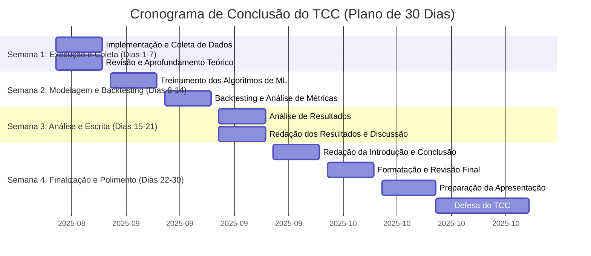

# Estrutura e Cronograma para o TCC
## 1. Estruturação do TCC conforme as Normas Acadêmicas
- **Título**: Revisar para um título conciso (máx. 15 palavras), sem expressões como "Estudo de...", "Análise de...", etc.
- **Resumo**: Elaborar um resumo conciso (máx. 250 palavras), no pretérito perfeito, contextualizando o problema, a metodologia, os resultados e a conclusão.
- **Introdução**: Delimitar bem o problema, justificar a relevância e incluir o objetivo claro no último parágrafo.
- **Metodologia (ou "Implementação de Algoritmo(s) de Machine Learning")**: Descrever os passos da coleta de dados, pré-processamento, escolha dos algoritmos (K-means, DBSCAN, Reinforcement Learning) e o framework de backtesting (Backtrader).
- **Resultados e Discussão**: Apresentar e interpretar os resultados do backtesting, comparando as métricas de performance (Sharpe, Sortino, etc.) do modelo de Machine Learning com as estratégias tradicionais.
- **Conclusão (ou "Considerações Finais")**: Resumir os achados e responder aos objetivos de pesquisa, sem adicionar novas informações.
- **Referências**: Revisar a lista de referências para garantir a formatação correta e a consistência com o texto.
## 2. Plano de Ação Acelerado
- **Fase 1: Preparação e Execução do Modelo (1-2 semanas)**
  - Revisão Bibliográfica Final e Coleta de Dados.
  - Ajustes na Metodologia e Implementação do Código.
- **Fase 2: Modelagem, Backtesting e Análise (2-3 semanas)**
  - Executar os algoritmos e rodar os backtests.
  - Coletar e compilar as métricas de performance em tabelas e gráficos.
- **Fase 3: Redação e Formatação (3-4 semanas)**
  - Redigir as seções de Resultados, Discussão e Conclusão.
  - Elaborar o Resumo.
  - Formatação e Revisão final do documento.

  Vou te falar como faria minha tese de doutorado hoje.

1. Organizaria o documento em 3 capítulos. O primeiro seria uma revisão sistemática de literatura. É um produto diferente, de fácil publicação e com alto potencial de impacto científico. 

2. No capítulo 2 eu faria uma discussão mais metodológica sobre COMO o meu problema tem sido tratado na literatura. Vc iria se beneficiar enormemente do capítulo 1 pois já teria mapeado isso. Incluiria também uma análise crítica dos casos, das variáveis e, principalmente, das técnicas. Esse capítulo poderia tender fácil um artigo tutorial sobre algum método específico.

3. No capítulo 3 eu traria o filé, o coração da tese. Pode ser o seu teste de hipótese, por exemplo. Como vc já fez uma revisão sistemática, a discussão dos resultados vai ficar muito azeitada. E como vc já revisou a parte metodológica, a sua tese provavelmente vai apresentar uma contribuição original nessa área tb.

Para fechar com chave de ouro, deixaria todos os dados e scripts computacionais disponíveis ANTES da defesa. Escreveria um artigo de opinião falando do tema para publicar no jornal local da minha cidade/estado. Com ajuda da IA, faria um sumário executivo de 1 página para incluir nos anexos e compartilhar com gestores públicos. E para finalizar faria um podcast ou palestra virtual com algum convidado especialista sobre o tema em uma conversa leve com linguagem simples para facilitar a divulgação científica do meu trabalho. 

Ao final, eu teria:

a) uma tese;
b) um artigo de revisão sistemática;
c) um artigo metodológico tutorial;
d) um paper top para publicar em uma revista prestigiosa;
e) um artigo de jornal;
f) uma potencial entrada no governo/consultoria;
g) meu nome divulgado nas redes sociais.

E, o mais importante, você nunca mais ouviria "quando é que você vai defender essa tese".